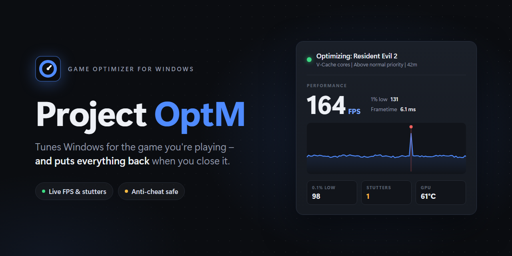

# Project OptM

Per-game performance optimizer for Windows 10/11. It detects which game you're playing and applies that game's profile automatically, then puts everything back when you close it.

Version 2 is a native app: one small ProjectOptM.exe that starts instantly and idles near 0% CPU.

## What it does

- **Core pinning:** pins games to the best CPU cores for your chip. That's the 3D V-Cache cores on dual-CCD X3D chips (7950X3D, 9950X3D and similar) and the P-cores on Intel 12th gen and newer. Games that use lots of threads can be steered there instead of locked.
- **Priority:** raises game priority and lowers background apps (browsers, Discord, launchers) while you play.
- **Anti-cheat safe mode:** games with kernel anti-cheat are never touched directly. They get Windows-applied launch priority plus system-side tweaks only.
- **Finds new games by itself:** when a game from Steam, Epic, GOG, Ubisoft, Xbox, EA or Riot starts, it's added to your games and optimized. Anti-cheat is detected and handled automatically.
- **Tweaks page:** every tweak with a switch, a description, and its pros and cons. Pick Safe, Balanced or Aggressive, or make and share your own presets. Tweaks that would hurt your hardware are locked.
- **Per-game settings:** the gear on each game sets its priority, cores, launch priority, RAM cleanup, apps to close or keep, and its own tweaks.
- **RAM cleanup:** clears standby memory, scaled to how much RAM you have.
- **Windows Update:** pauses update downloads while you play.
- **Power plan:** switches to High performance while gaming (except on X3D chips, which need Balanced). On laptops, switches Windows to Best performance.
- **Dedicated GPU:** locks games to your graphics card if you also have integrated graphics.
- **FPS graph:** live FPS, 1% lows and a frametime graph, read straight from Windows - nothing extra to download.
- **Session history:** every session is saved with its playtime and FPS, and each game has a history view showing how its FPS changes over time.
- **System health checks:** checks EXPO/XMP, refresh rate, Game Mode, background recording, Intel 13th/14th gen microcode and more. Many can be fixed with one click.
- **Restores everything:** when a game closes, when you exit, or instantly with the panic button (Ctrl+Alt+End or the tray menu).
- **Customization:** accent colors, backgrounds (including OLED black), corner styles and interface size.
- **Updates:** the app updates itself when a new version is released.
- **Feedback:** report a bug, suggest an idea or ask for a game from inside the app (sidebar or tray menu). It fills in a GitHub issue with the details you choose to include - you review it before anything is sent.

## Install

1. Download **ProjectOptM.exe** from the [latest release](../../releases/latest).
2. Put it anywhere (your Desktop is fine) and double-click it.
3. Click **Yes** on the admin prompt. It needs admin to change priorities, pause services and read frame timing.

If Windows shows "Windows protected your PC", click **More info → Run anyway**. This happens with any app that isn't code-signed yet, and only on the first run. Updates install from inside the app without the warning.

Requirements: Windows 10 or 11. Nothing else to install.

Coming from 1.x? Just run the new exe - your profiles, shortcuts, play history and theme carry over.

## Adding or editing games

Most games are added automatically the first time you play them. To change one, click the **gear** on its tile on the Games page.

You can also click **Edit profiles** to edit everything in Notepad - saving reloads it instantly. Each game is a short block:

```ini
[Cyberpunk 2077]
exe        = Cyberpunk2077
priority   = AboveNormal
cores      = Best
tweaks     = Balanced
```

To find a game's exe name, open Task Manager → Details while the game is running.

## Where things are stored

Everything lives in `%APPDATA%\ProjectOptM`:

- `profiles.ini`: your game profiles
- `settings.json`: shortcuts, theme, tweaks and toggles
- `history.csv`: your play sessions
- `backup\`: previous versions, kept whenever the app updates itself

To uninstall, exit the app (it puts everything back), then delete ProjectOptM.exe and that folder.

## Building from source

Project OptM is C++ (Win32, Direct3D 11 and [Dear ImGui](https://github.com/ocornut/imgui)). With Visual Studio 2022 or its free Build Tools installed, double-click `cpp\Build.bat`. See [cpp/README.md](cpp/README.md) for details.

```
cpp/              Project OptM 2.0 - the app
powershell-1.1/   the previous PowerShell version, kept for reference
assets/           images for this page
```

## Credits

The interface uses [Dear ImGui](https://github.com/ocornut/imgui) (MIT license).

## License

[MIT](LICENSE)
