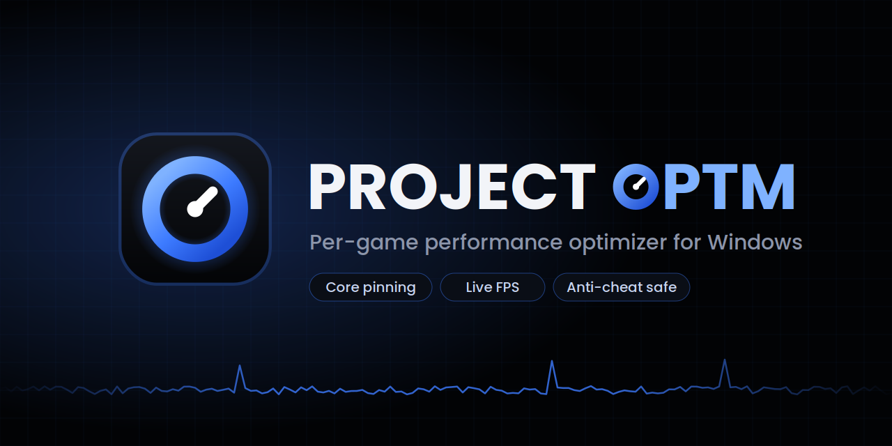

# Project OptM

Per-game performance optimizer for Windows 10/11. It detects which game you're playing and applies that game's profile automatically, then puts everything back when you close it.

## What it does

- **Core pinning:** pins games to the best CPU cores for your chip. That's the 3D V-Cache cores on dual-CCD X3D chips (7950X3D, 9950X3D and similar) and the P-cores on Intel 12th gen and newer.
- **Priority:** raises game priority and lowers background apps (browsers, Discord, launchers) while you play.
- **Anti-cheat safe mode:** games with kernel anti-cheat are never touched directly. They get Windows-applied launch priority plus system-side tweaks only.
- **RAM cleanup:** clears standby memory, scaled to how much RAM you have.
- **Windows Update:** pauses update downloads while you play.
- **Power plan:** switches to High performance while gaming (except on X3D chips, which need Balanced).
- **Dedicated GPU:** locks games to your graphics card if you also have integrated graphics.
- **FPS graph:** live FPS, 1% lows and a frametime graph, powered by Intel PresentMon.
- **System health checks:** checks EXPO/XMP, refresh rate, Game Mode, background recording and more. Many can be fixed with one click.
- **Customization:** accent colors, backgrounds (including OLED black) and corner styles.
- **Updates:** the app updates itself when a new version is released.

## Install

1. Download **ProjectOptM.exe** from the [latest release](../../releases/latest).
2. Put it anywhere (your Desktop is fine) and double-click it.
3. Click **Yes** on the admin prompt. It needs admin to change priorities and clear RAM.

If Windows shows "Windows protected your PC", click **More info → Run anyway**. This happens with any app that isn't code-signed yet, and only on the first run. Updates install from inside the app without the warning.

Requirements: Windows 10 or 11. Nothing else to install.

## Adding or editing games

Click **Edit profiles** in the app. Your profiles open in Notepad, and saving reloads them instantly. Each game is a short block:

```ini
[Cyberpunk 2077]
exe        = Cyberpunk2077
priority   = AboveNormal
cores      = Best
```

To find a game's exe name, open Task Manager → Details while the game is running.

## Where things are stored

Everything lives in `%APPDATA%\ProjectOptM`:

- `profiles.ini`: your game profiles
- `settings.json`: shortcuts, theme and toggles
- `backup\`: previous versions, kept whenever the app updates itself

To uninstall, delete the .bat file and that folder.

## Building from source

The whole app is one PowerShell script, `src/ProjectOptM.ps1`. `Build.bat` packs it into `ProjectOptM.exe` using the C# compiler that ships with Windows, so no SDK is needed.

## Credits

The FPS graph uses [Intel PresentMon](https://github.com/GameTechDev/PresentMon), which is downloaded only if you enable the graph.
